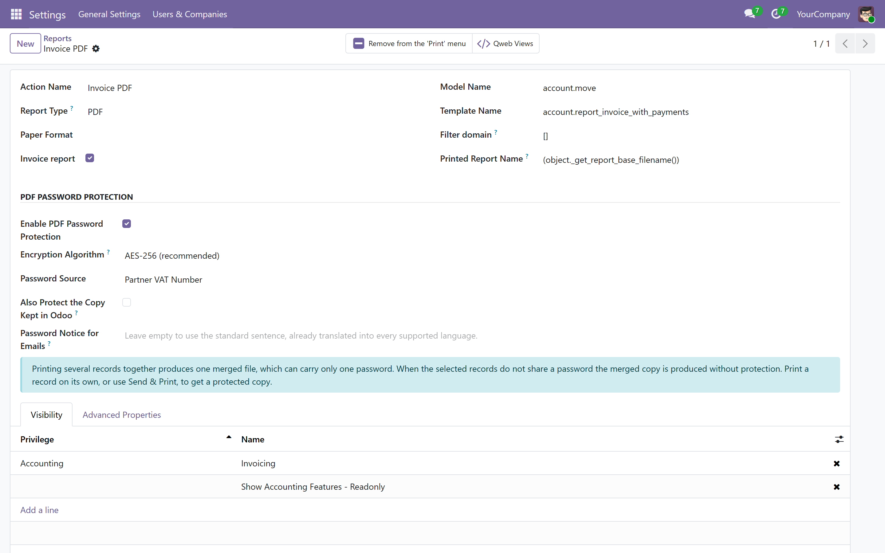
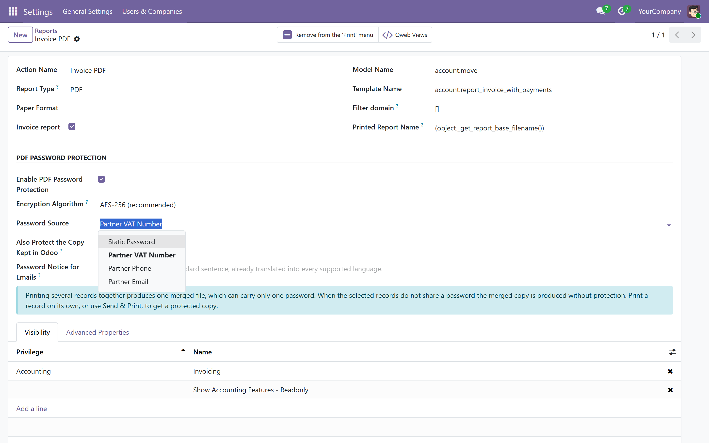
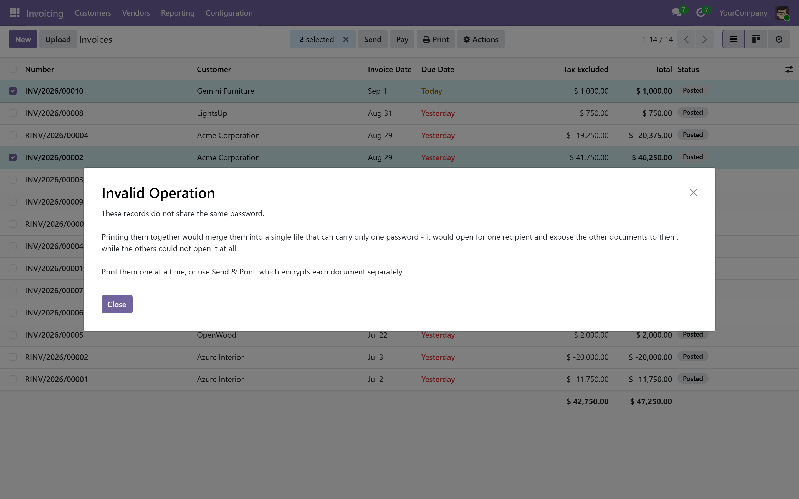
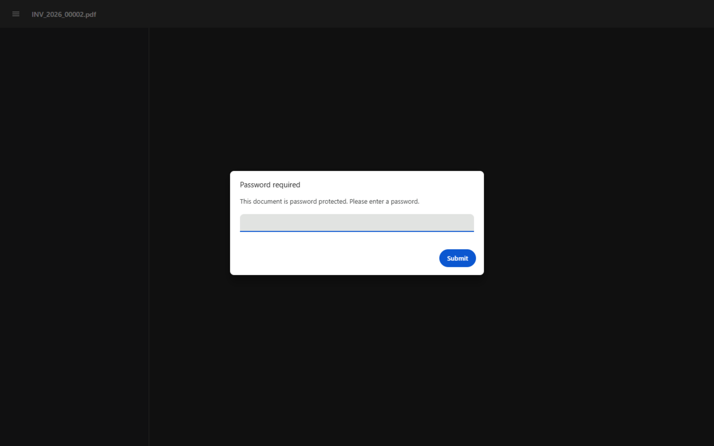
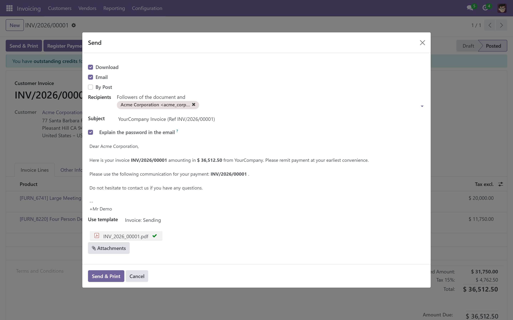
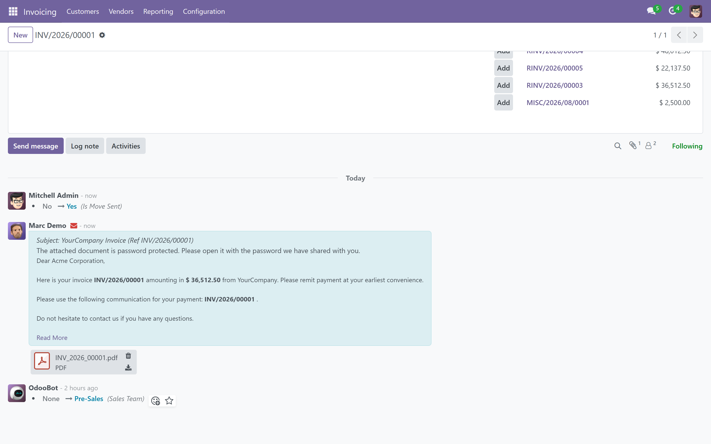

# PDF Password Protection

Encrypt Odoo PDF reports with passwords. Choose a static password or generate one dynamically from partner data (VAT number, phone, email).

## Two Modules, Published Separately

This repository holds two Odoo modules. Each is free, LGPL-3, and listed on the Apps store on its own.

| Module | What it covers | Needs |
|---|---|---|
| **`no_pdf_password_protection`** &mdash; *PDF Password Protection* | Every PDF report you print, or attach through an email template: quotations, delivery slips, payslips, purchase orders, custom reports. Also where you choose the password source and the encryption strength. | Nothing but Odoo |
| **`no_pdf_password_protection_account`** &mdash; *PDF Password Protection for Invoices* | The invoice Odoo **emails**, which Accounting builds by a different route. Each customer's copy gets that customer's own password. | The module above, plus Accounting |

**Use the first on its own and everything works.** The second is an add-on: it has no settings of its own, reads the configuration from the first, and installs itself automatically once both that module and Accounting are present. See [Invoice Emails (Send & Print)](#invoice-emails-send--print) below.

## Features

- **AES-256 Encryption** -- Modern, standards-based encryption by default. AES-128 and legacy RC4-128 remain selectable per report for very old readers.
- **Static Password** -- Set a fixed password for any report.
- **Dynamic from Partner VAT** -- Automatically use the partner's VAT number as the PDF password.
- **Dynamic from Partner Phone** -- Use the partner's phone or mobile number as the password, reduced to digits only so the recipient always knows what to type.
- **Dynamic from Partner Email** -- Use the partner's email address as the password.
- **Per-Report Configuration** -- Enable or disable password protection on each report individually.
- **Smart Fallback** -- If a dynamic field is empty, the module falls back to the static password.
- **Works with All QWeb PDF Reports** -- Invoices, quotations, payslips, delivery slips, and any custom report.
- **Covers Invoice Emails** -- With the companion module installed, "Send & Print" delivers an encrypted invoice too, each one using its own customer's password.
- **Translated into 9 Languages** -- English, French, Spanish, German, Dutch, Portuguese (BR), Italian, Chinese (Simplified), Arabic. Each user sees the dialog in their own Odoo language.

## How It Works

1. Go to **Settings > Technical > Actions > Reports** and select any QWeb PDF report.
2. Enable **"PDF Password Protection"** and choose the password source.
3. Generate the report. The output PDF is encrypted with the chosen password.

The module overrides `_render_qweb_pdf` on `ir.actions.report` to encrypt the generated PDF using pypdf (or PyPDF2 as a fallback) after Odoo renders it.

Encryption strength is set per report via **Encryption Algorithm**. AES-256 is the default and is readable by Acrobat 9+ and every modern PDF viewer. AES requires `pypdf`; on a deployment that only ships PyPDF2 the module logs a warning and falls back to RC4-128 rather than failing.

## Technical Details

| Item                  | Value                                              |
|-----------------------|----------------------------------------------------|
| Odoo Version          | 19.0                                     |
| License               | LGPL-3                                             |
| Dependencies          | `base`                                             |
| Python Dependencies   | None declared -- uses whichever of pypdf / PyPDF2 Odoo already ships |
| Custom Fields Prefix  | `x_` (upgrade-safe)                                |
| Encryption Standard   | AES-256 default; AES-128 and RC4-128 selectable    |
| Performance Impact    | Minimal (< 100ms per report)                       |
| Languages             | EN, FR, ES, DE, NL, PT-BR, IT, ZH-CN, AR           |

## Fields Added to `ir.actions.report`

| Field                      | Type      | Description                              |
|----------------------------|-----------|------------------------------------------|
| `x_pdf_password_enabled`   | Boolean   | Enable PDF password protection           |
| `x_pdf_password_method`    | Selection | Password source (static/vat/phone/email) |
| `x_pdf_static_password`    | Char      | Static password value                    |
| `x_pdf_encryption_algo`    | Selection | Cipher: `aes256` (default), `aes128`, `rc4_128` |
| `x_pdf_protect_stored_copy`| Boolean   | Encrypt the archived copy too (default off, see above) |
| `x_pdf_aes_unavailable`    | Boolean   | Computed; true when the server's PDF library cannot do AES |

## Invoice Emails (Send & Print)

Odoo builds the PDF it emails from an invoice through a different code path than the Print button, so protecting the report alone is not enough -- the Print button would hand you an encrypted file while the customer received a plaintext one.

The companion module **`no_pdf_password_protection_account`** (*PDF Password Protection for Invoices* on the Apps store) closes that gap. It ships in this repository, depends on this module plus Accounting, and encrypts the invoice at the last step of the send pipeline, after Odoo has finished its own post-processing. Because it works one invoice at a time, each customer's document is encrypted with *that customer's* password -- something the merged Print path cannot do.

It is marked `auto_install`, so it installs itself when you install PDF Password Protection on a database that already has Accounting. **If you already have both installed and are upgrading, Odoo will not pull it in retroactively** -- install `no_pdf_password_protection_account` once from the Apps list.

**PDF/A e-invoices are deliberately skipped.** ISO 19005 forbids encryption, so encrypting a Factur-X or ZUGFeRD invoice would break its conformance and make the embedded e-invoicing XML unreadable for the recipient's accounts-payable system. When the generated PDF declares PDF/A, the module leaves it unencrypted and posts a note in the invoice chatter explaining why.

## Behaviour You Should Know About

**Printing several customers at once is refused when the password is dynamic.** Odoo merges a multi-record print into one PDF, and a PDF carries a single password. That file would open for one recipient and expose the other customers' documents to them, while those customers could not open it at all. The module raises an explanatory error instead. Print one at a time, or use Send & Print, which encrypts each document separately. Batches that resolve to the same password -- one customer, or a static password -- are unaffected.

**Your own staff are not asked for a password.** The module protects documents that *leave* Odoo -- what you print, email, or publish on the portal. The copy Odoo archives on the record stays readable, so a colleague previewing an invoice from the chatter is not blocked by a password for a record they can already open; Odoo's access rights already govern who sees it. Every route out re-encrypts on the way, so nothing delivered is weakened by this.

Turn on **Also Protect the Copy Kept in Odoo** if you want encryption at rest as well.

**Emailed invoices are the one exception.** Odoo sends the very file it stores, so that copy is always encrypted and previewing it does ask for the password. That is inherent to how Accounting builds the document, not a setting.

**"Send by Post" is left unencrypted on purpose.** Snailmail hands the PDF to a postal printing provider that cannot open an encrypted file, so encryption is skipped for that render and noted in the log.

**PDF/A e-invoices are left unencrypted on purpose.** See the Send & Print section above.

**Portal downloads are encrypted.** A customer opening their invoice from the portal needs the password, even though they are already signed in. That is the point -- the file stays protected after it leaves Odoo -- but tell your customers, or they will call you.

**Passwords are capped at 127 bytes**, the limit in the PDF specification. Anything longer is refused rather than encrypted, because readers truncate over-long passwords differently and the recipient may end up unable to open the file.

**The static password is stored in the clear** and is readable by anyone who can read report definitions (typically Settings users) through the API, even though the form masks it. Treat it as a shared secret, not a credential.

**Multi-company:** the static password is a single value on the report, not per company. Companies sharing a report share its password.

**After uninstalling**, PDFs that were already encrypted stay encrypted -- the module is not needed to open them, but nothing can recover a password derived from partner data that has since changed.

## Screenshots

| | |
|---|---|
|  |  |
| Turn it on per report, pick the cipher, pick where the password comes from. | Static, or a different password per recipient from their VAT number, phone or email. |
|  |  |
| A merged file carries one password, so a mixed batch is stopped and explained. | The delivered file asks for the password in any modern PDF reader. |

Companion module (`no_pdf_password_protection_account`):

| | |
|---|---|
|  |  |
| Send the invoice as usual - no extra step. | The document that went out is locked; even Odoo's own preview asks for the password. |

## Installation

1. Place the `no_pdf_password_protection` folder in your Odoo addons directory.
2. Restart the Odoo server.
3. Go to **Apps**, remove the "Apps" filter, search for **"PDF Password Protection"**, and click **Install**.

## Configuration

1. Navigate to **Settings > Technical > Actions > Reports**.
2. Select the report you want to protect (e.g., "Invoices").
3. In the **PDF Password Protection** section:
   - Check **Enable PDF Password Protection**.
   - Choose the **Password Source**: Static Password, Partner VAT, Partner Phone, or Partner Email.
   - If using Static Password, enter the password value.
4. Save. All future PDF generations for that report will be encrypted.

## Docker Setup (Development)

```bash
docker-compose up -d
```

- Odoo: http://localhost:1816
- PostgreSQL: internal `db` service (no exposed port by default)

## Running Tests

```bash
docker exec -it pdfpwd-odoo-19 \
  odoo --test-enable --stop-after-init \
  -d test_db -i no_pdf_password_protection \
  --test-tags no_pdf_password_protection
```

## Languages

Ships with translations for:

| Code     | Language                |
|----------|-------------------------|
| `en_US`  | English (source)        |
| `fr`     | French                  |
| `es`     | Spanish                 |
| `de`     | German                  |
| `nl`     | Dutch                   |
| `pt_BR`  | Portuguese (Brazil)     |
| `it`     | Italian                 |
| `zh_CN`  | Chinese (Simplified)    |
| `ar`     | Arabic                  |

Each user sees the dialog in the language set in **Preferences -> Language**. Regional variants (e.g. `fr_BE`, `nl_BE`) inherit from the base language via Odoo's standard fallback. To add a new language, drop a `<code>.po` file into `i18n/` - the canonical template is `i18n/no_pdf_password_protection.pot`.

## GDPR & Compliance

Under GDPR Article 32, organizations must implement appropriate technical measures to secure personal data. Password-encrypting PDF reports that contain partner names, addresses, VAT numbers, and financial details helps satisfy this requirement.

## Compatibility

- Odoo 19.0 Community and Enterprise
- Works with any module that generates QWeb PDF reports (Accounting, Sale, Purchase, HR, Stock, etc.)

## Author

**Naim OUDAYET** - Odoo developer based in Tunisia.

- Website: [oudayet.com](https://www.oudayet.com)
- Email: contact@oudayet.com
- GitHub: [@naimoudayet](https://github.com/naimoudayet)
- [Odoo App Store](https://apps.odoo.com/apps/modules/19.0/no_pdf_password_protection)

## License

This module is licensed under [LGPL-3](https://www.gnu.org/licenses/lgpl-3.0.html).
